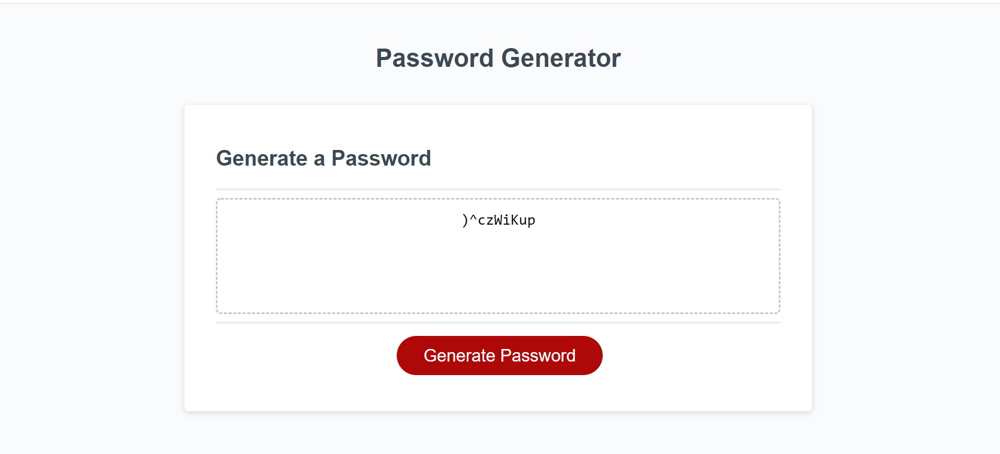

# 03 JavaScript: Password Generator

## My Task

This week’s homework required me to create an application that an employee can use to generate a random password based on criteria they’ve selected. The application is optimized for browers, however it is recommended to use Chrome. The user interface is responsive, so it adapts to multiple screen sizes.

The password can include lower case, upper case, number or special characters. Approved special characters can be referenced here: [list of Password Special Characters from the OWASP Foundation](https://www.owasp.org/index.php/Password_special_characters).

## User Interface
```
The user clicks the "Generate Password" button
The interface presents the user with a series of questions asking about required paswoord length and type of characters to include in the password.
The application validates the user inputs ensuring that the specificed password length is between 8 and 128 character, abd at least one of the four criteria is selected. 
```
## Mock-Up

The following image shows the web application's appearance and functionality:



### ApplicationDeployment: 
The application can be accessed through URL [password generator](https://asheth22.github.io/pwd-generator/)

- - -
© 2020 Trilogy Education Services, a 2U, Inc. brand. All Rights Reserved.
